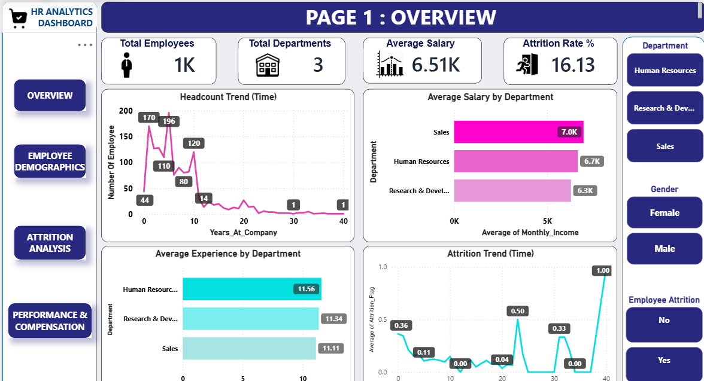
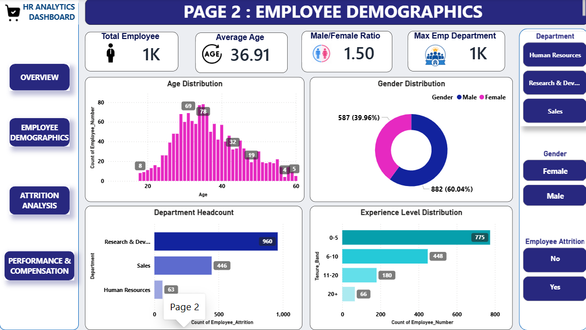
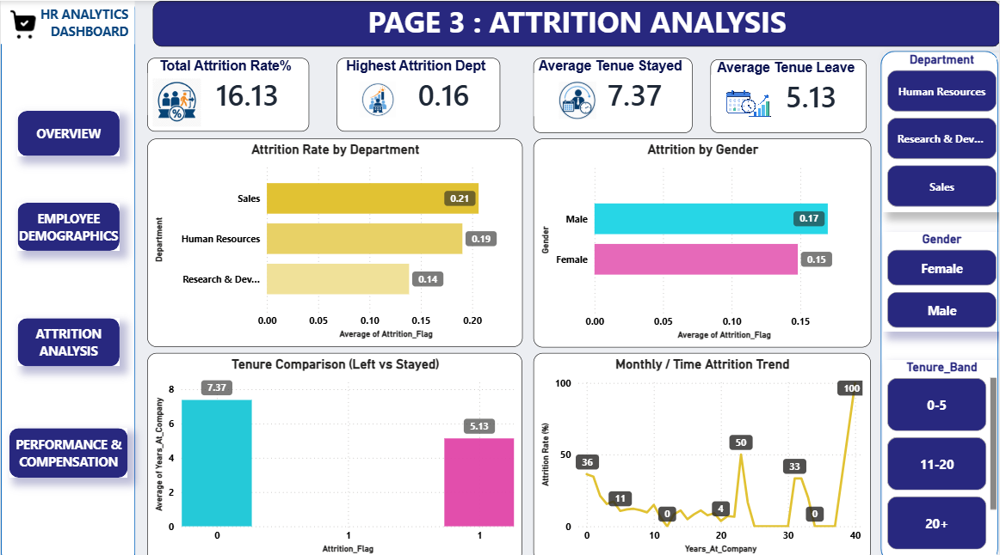
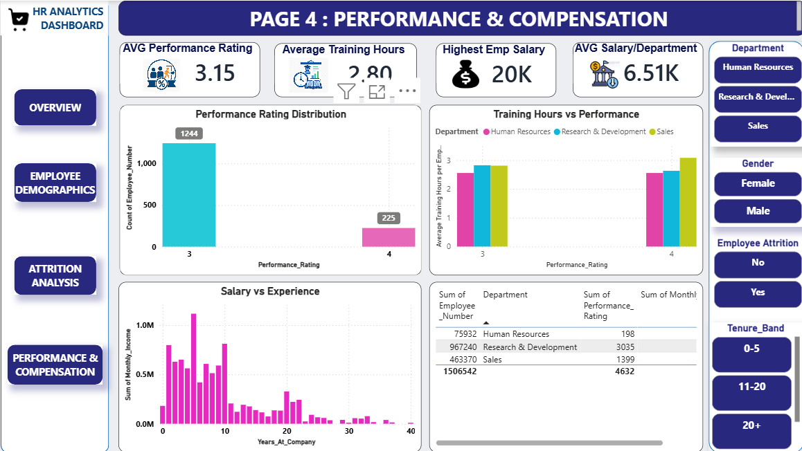

# 🚀 HR Workforce Analytics PowerBI SQL

<div align="center">


## 📊 End-to-End HR Analytics Project

### Employee Attrition • Workforce Insights • Performance Analysis • Diversity Analytics

</div>

---

## 📌 Project Overview

This project is a complete **HR Workforce Analytics Dashboard** developed using **Power BI, SQL, Excel, and Data Visualization techniques**.

The dashboard helps HR teams and business leaders analyze:

* Employee Attrition
* Workforce Distribution
* Department Analysis
* Gender Diversity
* Salary Trends
* Employee Performance
* Promotion Insights
* Employee Satisfaction
* Workforce Demographics

The goal of this project is to convert raw HR data into meaningful business insights for better decision-making.

---

## 🛠️ Tools & Technologies Used

<div align="center">

| Tool                                                                                      | Purpose                            |
| ----------------------------------------------------------------------------------------- | ---------------------------------- |
|  | Dashboard Creation & Visualization |
|                | Data Analysis & Querying           |
|  | Data Cleaning & Preprocessing      |
|                           | KPI Measures & Calculations        |
|                      | Business Insights                  |
|                   | Interactive Reporting              |

</div>

---

## 📂 Project Structure

```bash
📁 HR-Workforce-Analytics
│
├── 📊 Excel_HR_Cleaned_Data.xlsx
├── 🖼️ hr_dashboard_overview.png
├── 🖼️ hr_dashboard_demographics.png
├── 🖼️ hr_dashboard_attrition.png
├── 🖼️ hr_dashboard_performance.png
├── 🗄️ HR_EDA.py
├── 📄 HR_Dashboard.pbix
└── 📄 README.md
```

---

## 🎯 Business Problem

#### Organizations face several HR challenges such as:

* High employee attrition (16.13% total attrition)
* Poor workforce visibility
* Salary imbalance (Average Salary 6.51K)
* Department-wise performance gaps
* Promotion delays
* Lack of diversity insights

This dashboard solves these problems by providing a centralized HR analytics solution.


## 📈 Dashboard Features
✅ KPI Cards
* Total Employees – 1K
* Total Departments – 3
* Average Salary – 6.51K
* Attrition Rate – 16.13%
* Average Tenure Stayed – 7.37 years
* Average Tenure Leave – 5.13 years
* Average Training Hours – 2.80
* Highest Employee Salary – 20K


## 📊 Dashboard Visuals

#### Employee Overview (Page 1)

* Headcount Trend over Years
* Average Experience by Department
* Average Salary by Department
* Attrition Trend

#### Employee Demographics (Page 2)

* Age Distribution (Average Age – 36.91)
* Gender Distribution (Male/Female Ratio 1.5)
* Department Headcount
* Experience Level Distribution

#### Attrition Analysis (Page 3)

* Attrition Rate by Department
* Attrition by Gender
* Tenure Comparison (Stayed vs Left)
* Monthly / Time Attrition Trend

#### Performance & Compensation (Page 4)

* Performance Rating Distribution (Avg Rating 3.15)
* Average Training Hours vs Performance
* Salary vs Experience
* Avg Salary per Department


## 📷 Dashboard Preview

### Dashboard Page 1 – Overview



### Dashboard Page 2 – Employee Demographics



### Dashboard Page 3 – Attrition Analysis



### Dashboard Page 4 – Performance & Compensation


📌 Important Power BI Measures (DAX)


* Employee Count

Employee Count = DISTINCTCOUNT(Employee[EmployeeID])

* Attrition Count

* Attrition Count = CALCULATE([Employee Count], Employee[Attrition] = "Yes")

Attrition Rate

* Attrition Rate = DIVIDE([Attrition Count], [Employee Count]) * 100


## 🗄️ Python Analysis Included
* Employee Count Analysis
* Department-wise Distribution
* Salary Insights
* Attrition Analysis
* Performance Metrics
* Workforce Segmentation

## 📊 Key Insights Generated
* Sales department has the highest attrition (21%)
* Average tenure stayed 7.37 years, leave 5.13 years
* Gender diversity – 60% Male, 40% Female
* Avg Salary – 6.51K; Highest – 20K
* Performance vs Training Hours insights
* Attrition trend spikes at specific tenure periods


## 👨‍💻 Author

SANJU VERMA

Aspiring Data Analyst | Power BI Developer | SQL Enthusiast

## 🌟 Future Improvements
* AI-based Attrition Prediction
* Real-time HR Monitoring
* Employee Recommendation System
* Cloud Deployment
* Advanced Workforce Forecasting


## 📚 Learning Outcomes
* Power BI Dashboard Development
* DAX Measures
* SQL Analytics
* Data Cleaning
* HR Analytics Concepts
* Interactive Data Visualization
* Business Intelligence Reporting


## ⭐ Support

#### If you found this project helpful:

* Star this repository
* Fork this repository
* Share with others


## 📜 License

#### This project is for educational and portfolio purposes.

<div align="center">

🚀 Transforming HR Data into Business Intelligence

Built with ❤️ using Power BI, SQL & Excel

</div> ```
